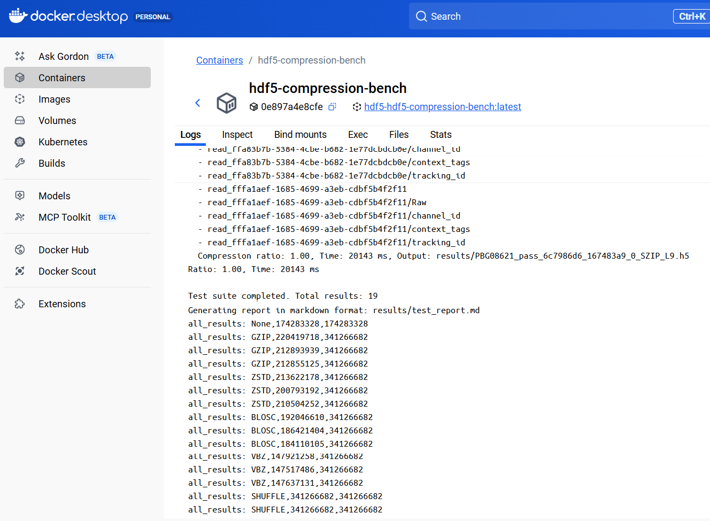
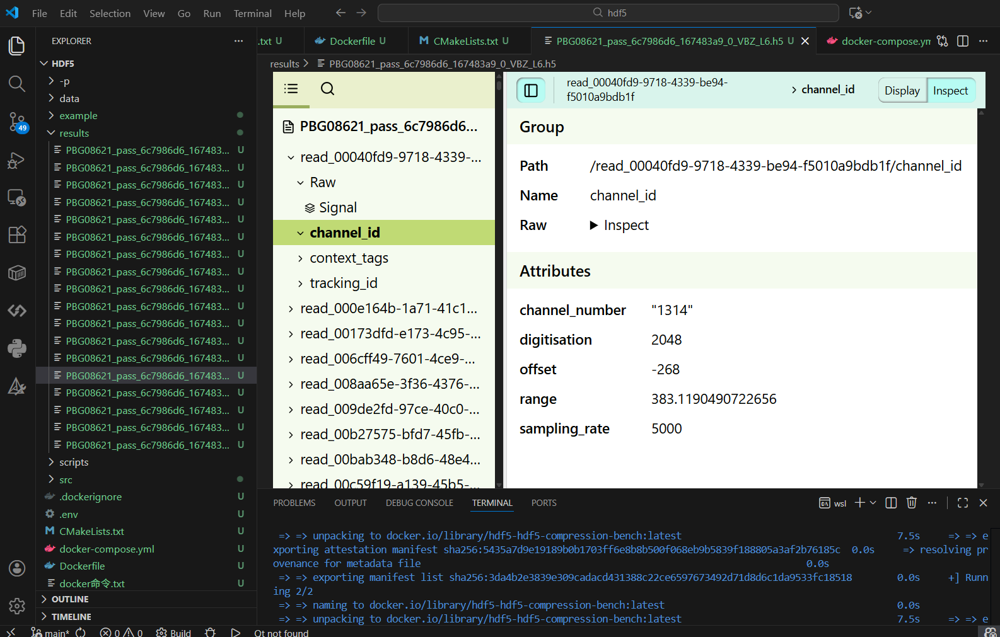
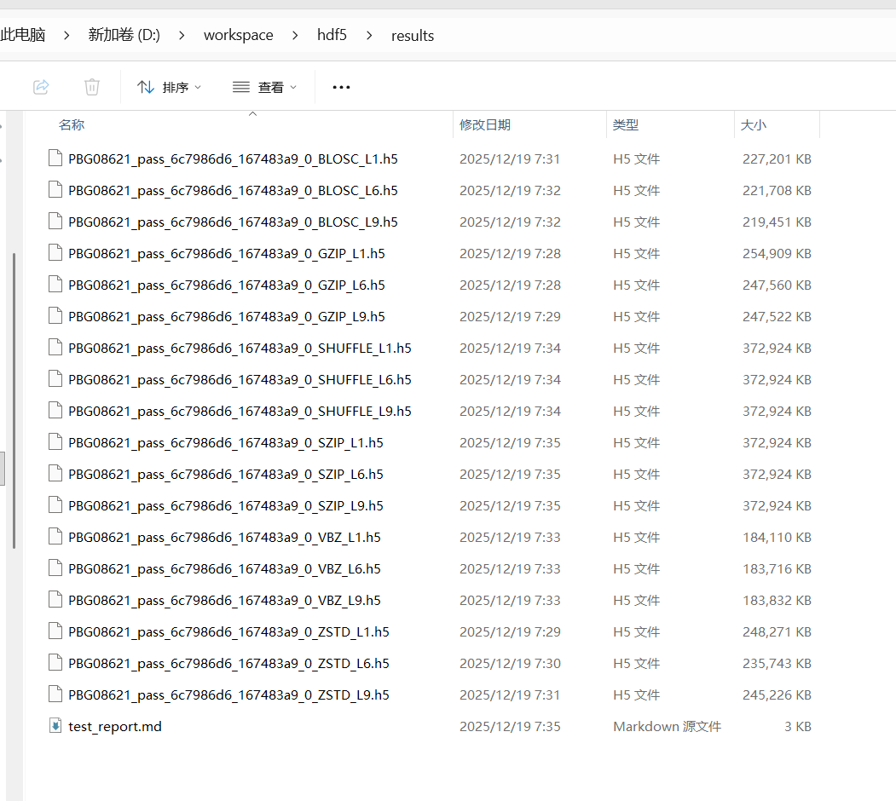
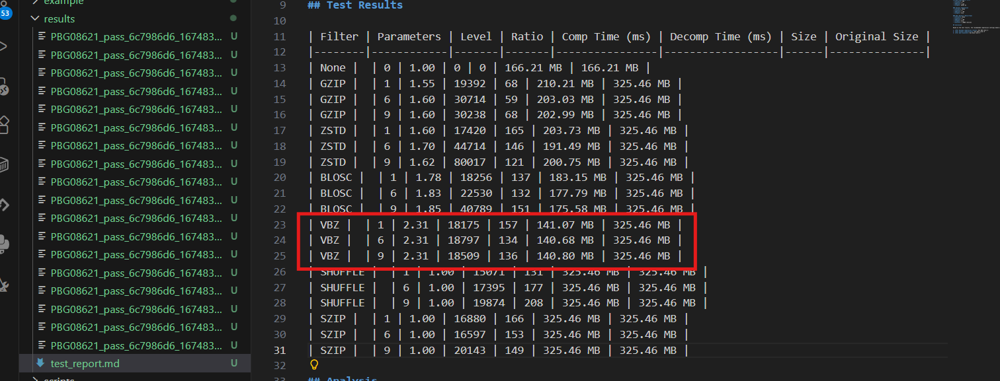

# HDF5 压缩算法测试项目

## 项目概述

本项目是一个用于测试 HDF5 各种压缩过滤器的命令行应用程序，专门针对 int16 信号数据寻找最优压缩方案。项目使用 C++开发，支持 Docker 环境管理、CMake 构建系统。

## 功能结构

```
hdf5-compression-bench/
├── CMakeLists.txt # 主 CMake 配置文件
├── Dockerfile # Docker 构建配置
├── docker-compose.yml # Docker 编排配置
├── .dockerignore # Docker 忽略文件
├── merge_hdf5.bat # Windows 环境下合并 HDF5 文件的批处理脚本
├── merge_hdf5.sh # Linux 环境下合并 HDF5 文件的脚本
├── src/ # 源代码目录
│ ├── main.cpp # 主程序入口
│ ├── hdf5_processor.hpp # HDF5 处理类头文件
│ ├── hdf5_processor.cpp # HDF5 处理类实现
│ ├── compression_tester.hpp # 压缩测试类头文件
│ ├── compression_tester.cpp # 压缩测试类实现
│ ├── utils.hpp # 工具函数头文件
│ └── utils.cpp # 工具函数实现
├── data/ # 数据文件目录
├── results/ # 测试结果目录
├── example/ # 第三方插件的使用示例程序，不参与构建
├── HOMEWORK_README.md # 任务输入文档
└── README.md # 项目概述文档
```

## 功能特性

### 核心功能

- **文件合并**: 自动合并拆分的 HDF5 文件
- **VBZ 解压**: 使用 VBZ 插件解压原始 HDF5 文件
- **基准生成**: 创建未压缩的基准文件用于压缩比计算
- **压缩测试**: 测试多种 HDF5 压缩过滤器
- **性能评估**: 测量压缩比、压缩时间和解压时间
- **报告生成**: 自动生成测试结果报告

### 支持的压缩过滤器

- **标准 HDF5 过滤器**: GZIP, SZIP, SHUFFLE
- **第三方过滤器**: GZIP,ZSTD,BLOSC,VBZ,SHUFFLE,SZIP（BLOC2 和 LZ4 需要修改 Dockerfile 中的插件版本，目前不支持）
- **组合测试**: 不支持

## 快速开始

### 使用 wsl + Docker（推荐）

```bash

# 安装环境wsl和docker desktop
#（具体安装细节请参考网路教程，部分docker指令可参考根目录下的"docker命令.txt"）

# 克隆项目
git clone <repository-url>
cd hdf5-compression-bench

# 准备测试数据,执行脚本合并数据
bash merge_hdf5.sh

# 配置测试参数
INPUT_FILE=PBG08621_pass_6c7986d6_167483a9_0.hdf5
FILTERS=GZIP,ZSTD,BLOSC,VBZ,SHUFFLE,SZIP

# 构建Docker镜像，自动运行测试logs指令查看进度
docker compose up -d  #可打开docker desktop查看测试运行进度，log日志，或者通过docker run/

# 查看测试结果(位于results目录下，包括生成的压缩文件.h5和测试报告test_report.md)
cat results/test_report.md
```

## 压缩文件格式命名

本项目生成的压缩文件遵循统一的命名规范，便于识别和比较不同压缩算法的效果。

### 命名格式

```
{原始文件名（不含扩展名）}_{过滤器名称}_L{压缩级别}.h5
```

### 格式说明

1. **原始文件名（不含扩展名）**：输入 HDF5 文件的基本名称，去除文件扩展名

   - 例如：`PBG08621_pass_6c7986d6_167483a9_0`

2. **过滤器名称**：使用的压缩过滤器名称，使用大写字母表示

   - 例如：`GZIP`、`SZIP`、`SHUFFLE`、`VBZ`、`LZ4`、`ZSTD`等

3. **压缩级别**：压缩算法的级别，用`L`前缀加数字表示

   - 例如：`L1`、`L6`、`L9`等
   - 不同过滤器支持的级别范围不同：
     - GZIP/DEFLATE：1-9（1 最快压缩，9 最高压缩比）
     - SZIP：4、8、32（像素每块）
     - 其他过滤器通常支持 1-9 级别

4. **文件扩展名**：`.h5`，标准的 HDF5 文件扩展名

### 示例文件

基于输入文件 `PBG08621_pass_6c7986d6_167483a9_0.hdf5`，生成的压缩文件示例：

- `PBG08621_pass_6c7986d6_167483a9_0_GZIP_L1.h5` - GZIP 压缩，级别 1
- `PBG08621_pass_6c7986d6_167483a9_0_GZIP_L6.h5` - GZIP 压缩，级别 6
- `PBG08621_pass_6c7986d6_167483a9_0_GZIP_L9.h5` - GZIP 压缩，级别 9

### 文件存储位置

所有生成的压缩文件默认保存在 `results/` 目录下，与测试报告 `test_report.md` 位于同一目录，便于统一管理和分析。

## 部分结果展示

### 构建过程截图


### Docker 日志输出



### 压缩结果初步确认



### 压缩后结果输出



### 测试报告生成



## 其他说明

本项目在 AI 辅助下完成
